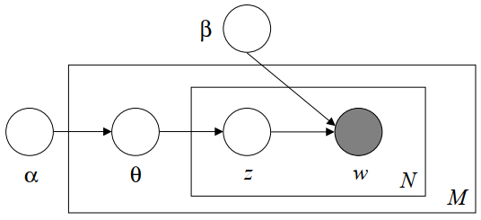

# Latent Dirichlet Allocation
**Latent Dirichlet allocation（潜在狄利克雷分配、LDA）** 是一种用于离散数据集合的概率生成模型。LDA 是一个三层贝叶斯模型，它将集合中的每个项目建模为一系列潜在主题的有限混合，而每个主题又被建模为一系列主题概率的无限混合。[^blei] LDA 常被用于对语料库进行建模。

LDA assumes the following generative process for each document $\mathbf w$ in a corpus $D$:

1. Choose $N\sim \text{Poisson}(\xi)$
2. Choose $\theta\sim\text{Dir}(\alpha)$
3. For each of the $N$ words $w_n$:
  1. Choose a topic $z_n\sim\text{Multinomial}(\theta)$
  2. Choose a word $w_n$ from $p(w_n|z_n,\beta)$, a multinomial probability conditioned on the topic $z_n$

A $k$-dimensional Dirichlet random variable $\theta$ can take values in the $(k-1)$-simplex and has the following probability density on this simplex:

$$p(\theta|\alpha)={ \Gamma(\sum_{i=1}^k \alpha_i) \over \prod_{i=1}^k \Gamma(\alpha_i) } \theta_1^{\alpha_1-1} \cdots \theta_k^{\alpha_k-1}$$
where the parameter $\alpha$ is a $k$-vector with components $\alpha_i>0$, and where $\Gamma(x)$ is the Gamma function.

之所以选择 Dirichlet 分布，一方面是因为它属于指数族，具有有限个多维的充分统计量，另一方面是因为它对多项分布是 conjugate 的。

Given the parameters $\alpha$ and $\beta$, the joint distribution of a topic mixture $\theta$, a set of $N$ topics $z$, and a set of $N$ words $\mathbf w$ is given by:[^blei]

$$p(\theta,z,\mathbf w | \alpha,\beta) = p(\theta | \alpha) \prod_{n=1}^N p(z_n|\theta) p(w_n|z_n,\beta)$$

## Inference
- Gibbs sampling

## Similarity measures
可以通过 LDA 推断出文档的主题分布，进而通过主题分布的距离来度量文档间的距离。

主题分布的距离可以使用以下度量方法来度量：
- Cosine
- Kullback-Leibler divergence

  [probability - KL divergence of multinomial distribution - Mathematics Stack Exchange](https://math.stackexchange.com/questions/485810/kl-divergence-of-multinomial-distribution)

  - Jensen-Shannon divergence
- Euclidian distance

## 词处理
- 去除停用词能够提升 LDA 的性能
- Gensim 的官方教程中使用文档频率移除了罕见词和常见词，这可能会导致无法通过关键字匹配到部分文档

## 主题数问题
LDA 需要手动确定主题数，不同的主题数会影响模型效果。

## 短文本问题
LDA 对于短文本的建模能力较差，从短文本中推断出的主题分布会高度偏向于少数几个主题。

当使用短文本匹配长文本时，一种优化方法是跳过推断短文本的主题分布，直接计算从长文本的主题分布生成短文本的概率：

$$\prod_{w\in W_i}\sum_{k=1}^n p(w|z_k)p(z_k|W_j)$$
其中 $W_1$ 是短文本， $W_2$ 是长文本。

另一种优化方法是增加主题数。

另一方面，当文本的长度不均匀时，考虑到长文本生成查询词的概率高于短文本，可以将文本长度也纳入评分依据。但要注意的是，必须要小心确定概率与长度的权重，否则很低概率的长文本的得分会高于高概率的短文本。

[主题模型TopicModel：LDA的缺陷和改进_-柚子皮-的博客-CSDN博客_lda模型的优缺点](https://blog.csdn.net/pipisorry/article/details/45307369)

## Word embedding
LDA 考虑了文档的语义，但没有考虑词语的语义，直接将每个词编码为了一个整数。使用词嵌入可以将词语编码到语义空间，但由于 LDA 中的主题是多项式分布，并不能直接将词嵌入应用到 LDA 中。

- Word2vec
  - lda2vec[^lda2vec]

    [cemoody/lda2vec](https://github.com/cemoody/lda2vec)

    [LDA2vec Topic Modelling | DataCamp](https://www.datacamp.com/tutorial/lda2vec-topic-model)
    
- BERT

## Information sources
Books:
- [《LDA 数学八卦》](https://bloglxm.oss-cn-beijing.aliyuncs.com/lda-LDA%E6%95%B0%E5%AD%A6%E5%85%AB%E5%8D%A6.pdf)
- [Notes on Dirichlet Processes](https://dp.tdhopper.com/)

[^blei]: Blei, David M. “Latent Dirichlet Allocation,” 2003, 30.
[^lda2vec]: Moody, Christopher E. “Mixing Dirichlet Topic Models and Word Embeddings to Make Lda2vec.” arXiv, May 6, 2016. [http://arxiv.org/abs/1605.02019](http://arxiv.org/abs/1605.02019).