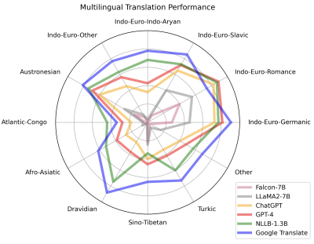

# Translation
[Wikipedia](https://en.wikipedia.org/wiki/Machine_translation)

[Meta AI Research Topic - No Language Left Behind](https://ai.meta.com/research/no-language-left-behind/)

## LLM
[Machine Translation with LLMs Reading List](https://github.com/hsing-wang/Awesome-LLM-MT)

- 2023-01 [Prompting Large Language Model for Machine Translation: A Case Study](https://arxiv.org/abs/2301.07069)

- 2023-01 [Is ChatGPT A Good Translator? Yes With GPT-4 As The Engine](https://arxiv.org/abs/2301.08745)

  

  Conducted by Tecent.

  Evaluation method: BLEU, ChrF++ and TER

  ~~GPT 在中文翻译上的表现不如其它翻译，但考虑到 GPT-3 的中文语料只占 0.16%，GPT-4 的中文语料占比应该也很小，能取得这样的性能已经表现很好了。~~

- 2023-02 [How Good Are GPT Models at Machine Translation? A Comprehensive Evaluation](https://arxiv.org/abs/2302.09210)

  

  Conducted by Microsoft.

  Models:
  - text-davinci-002
  - text-davinci-003 (GPT 3.5)
  - ChatGPT

  Evaluation method:
  - Sentence-level: COMET-22, COMETkiwi, SacreBLEU, Chrf
  - Document-level: Doc-COMETkiwi
  - Human: source-based sentence-level contrastive Direct Assessment + Scalar Quality Metric with annotations provided by professional annotators

    

- 2023-04 [Large language models effectively leverage document-level context for literary translation, but critical errors persist](https://arxiv.org/abs/2304.03245)

- 2023-04 [Multilingual Machine Translation with Large Language Models: Empirical Results and Analysis](https://arxiv.org/abs/2304.04675)

  - How well do LLMs perform in translating massive languages?

    

    > GPT-4 has beat the strong supervised baseline NLLB in 40.91% of translation directions but still faces a large gap towards the commercial translation system, especially on low-resource languages.

  - Which factors affect LLMs’ performance in translation?
  
    > - First, instruction semantics can surprisingly be ignored when given in-context exemplars.
    > - Second, cross-lingual exemplars can provide better task guidance for low-resource translation than exemplars in the same language pairs.
    > - Third, LLM can acquire translation ability in a resource-efficient way and generate moderate translation even on zero-resource languages.

  Evaluation method: SentencePiece BLEU, COMET and SEScore on FLORES-101

- 2023-05 [Augmenting Large Language Model Translators via Translation Memories](https://arxiv.org/abs/2305.17367)

- 2023-12 [An In-depth Look at Gemini's Language Abilities](https://arxiv.org/abs/2312.11444v2)

  

  

  Chinese is not tested.

- 2024-03 [Translation is one of the most underrated of Gemini Advanced's capabilities : r/Bard](https://www.reddit.com/r/Bard/comments/1b8svx4/translation_is_one_of_the_most_underrated_of/)

  Chinese:

  

LLM 的翻译效果可能与具体领域有不小关联。

[\[Discussion\] Translation of Japanese to English using GPT. These are my discoveries after ~100 hours of extensive experimentation and ways I think it can be improved. : MachineLearning](https://www.reddit.com/r/MachineLearning/comments/12pqqg6/discussion_translation_of_japanese_to_english/)

[Best local LLM for translating text? : LocalLLaMA](https://www.reddit.com/r/LocalLLaMA/comments/12o25ca/best_local_llm_for_translating_text/)

Tools:
- [ChatGPT Markdown Translator: CLI to translate Markdown docs using ChatGPT API](https://github.com/smikitky/chatgpt-md-translator)
- [🌎 Markdown Translation BOT: 💬Translate Markdown into Any Languages with AI](https://github.com/3ru/gpt-translate)
- ChatGPT

  [推荐2个GPT插件 - 发现频道 🔎 - 小众软件官方论坛](https://meta.appinn.net/t/topic/45964)
- Copilot Chat
- Cursor

  [GPT + Cursor = 翻译神器](https://iriszhang.club/gpt-cursor)

[认真用用 AI 翻译，再聊聊今后的人工翻译](https://mp.weixin.qq.com/s/Qi7iUUoNw_1bW9JTXyvakQ)

## Services
[20家机器翻译大比拼 | 袁保康的技术天地](https://kangear.github.io/cloud/2022/03/18/cloud-translate-price.html)

[Translators: 🌏🌍🌎Translators🌎🌍🌏 is a library that aims to bring free, multiple, enjoyable translations to individuals and students in Python. Translators是一个旨在用Python为个人和学生带来免费、多样、愉快翻译的库。](https://github.com/UlionTse/translators)

### Google Translate
- [py-googletrans: (unofficial) Googletrans: Free and Unlimited Google translate API for Python. Translates totally free of charge.](https://github.com/ssut/py-googletrans)
- [google\_trans\_new: A free and unlimited python API for google translate.](https://github.com/lushan88a/google_trans_new)
- [py-googletranslation: pygoogletranslation: Free and Unlimited Google translate API for Python. Translates totally free of charge.](https://github.com/Saravananslb/py-googletranslation)
- [easygoogletranslate: Easy Google Translate: Unofficial Google Translate API](https://github.com/ahmeterenodaci/easygoogletranslate)

### DeepL
- [DeepLX: DeepL Free API (No TOKEN required)](https://github.com/OwO-Network/DeepLX)

### Tecent
> 文本翻译的每月免费额度为5百万字符

> 单次请求的字符数不超过2000（一个汉字、一个字母、一个标点都计为一个字符）。