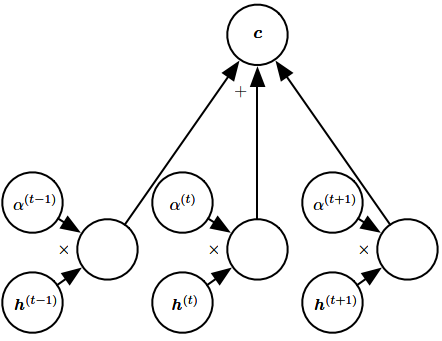

# Attention
[Wikipedia](https://en.wikipedia.org/wiki/Attention_(machine_learning))

**Attention** is a technique that is meant to mimic cognitive attention. The effect enhances some parts of the input data while diminishing other parts — the motivation being that the network should devote more focus to the important parts of the data, even though they may be small. Learning which part of the data is more important than another depends on the context, and this is trained by gradient descent.

Attention's flexibility comes from its role as "soft weights" that can change during runtime, in contrast to standard weights that must remain fixed at runtime.[^wiki]

We can think of an attention-based system as having three components[^deeplearning]:
1. A process that **reads** raw data (such as source words in a source sentence) and converts them into distributed representations, with one feature vector associated with each word position.
2. A list of feature vectors $h$ storing the output of the reader. This can be understood as a **memory** containing a sequence of facts, which can be retrieved later, not necessarily in the same order, without having to visit all of them.
3. A process that **exploits** the content of the memory to sequentially perform a task, at each time step having the ability put attention on the content of one memory element (or a few, with a different weight $a$).

## Self-attention
[What Is Attention in Language Models?](https://txt.cohere.com/what-is-attention-in-language-models/)

[cnn - What's the difference between Attention vs Self-Attention? What problems does each other solve that the other can't? - Data Science Stack Exchange](https://datascience.stackexchange.com/questions/49468/whats-the-difference-between-attention-vs-self-attention-what-problems-does-ea)

## Query-key mechanism
When the **query-key mechanism** is used, a query vector $q_i$ and key vector $k_i$ are calculated from the embedding. The weights are obtained by taking the softmax function of the dot product $q_ik_j$ where $i$ represents the current token and $j$ iterates over the other tokens.

When query, key and value are calculated from the same embedding, it is called self-attention; otherwise, when query, key and value are calculated from two embeddings, it is called **cross-attention**.

Some architectures use **multi-head attention**, in which each head operating independently with its own queries, keys, and values.

[Transformer’s Self-Attention Mechanism Simplified](https://vaclavkosar.com/ml/transformers-self-attention-mechanism-simplified)

[Cross-Attention in Transformer Architecture](https://vaclavkosar.com/ml/cross-attention-in-transformer-architecture)

[^wiki]: [Attention (machine learning) - Wikipedia](https://en.wikipedia.org/wiki/Attention_(machine_learning))
[^deeplearning]: Goodfellow, Ian, Yoshua Bengio, and Aaron Courville. _Deep Learning_. MIT Press, 2016.