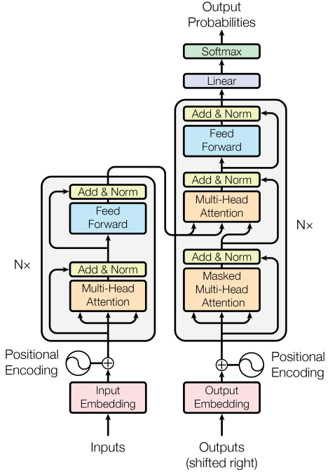

# Transformer
[Wikipedia](https://en.wikipedia.org/wiki/Transformer_(machine_learning_model))

**Transformer** is a model architecture eschewing recurrence and instead relying entirely on an attention mechanism to draw global dependencies between input and output.[^allyouneed]

[What Are Transformer Models and How Do They Work?](https://txt.cohere.com/what-are-transformer-models/)

[Transformers from Scratch](https://e2eml.school/transformers.html)

[What is the positional encoding in the transformer model? - Data Science Stack Exchange](https://datascience.stackexchange.com/questions/51065/what-is-the-positional-encoding-in-the-transformer-model)

[What Algorithms can Transformers Learn? A Study in Length Generalization](https://arxiv.org/abs/2310.16028) ([r/MachineLearning](https://www.reddit.com/r/MachineLearning/comments/17h43e9/r_what_algorithms_can_transformers_learn_a_study/))

## Tokens
2022-10-17 [Token Merging: Your ViT but Faster](https://github.com/facebookresearch/ToMe)
- 2023-03-30 [Token Merging for Fast Stable Diffusion](https://github.com/dbolya/tomesd)
  - [ToMe extension for Stable Diffusion A1111 WebUI](https://github.com/SLAPaper/a1111-sd-webui-tome)

    在图像尺寸较小时会导致性能降低。

## Libraries
- [🤗 Transformers: State-of-the-art Machine Learning for Pytorch, TensorFlow, and JAX.](https://github.com/huggingface/transformers)
  - [Backends](https://huggingface.co/docs/transformers/en/index#supported-models-and-frameworks): PyTorch, TensorFlow, JAX

  [How to make transformers examples use GPU? - Issue #2704](https://github.com/huggingface/transformers/issues/2704)

  [Downloading a model from the hub without loading it - 🤗Transformers - Hugging Face Forums](https://discuss.huggingface.co/t/downloading-a-model-from-the-hub-without-loading-it/48377)
  - There is no easy way to only download a model but not load it.

- [Curated Transformers: 🤖 A PyTorch library of curated Transformer models and their composable components](https://github.com/explosion/curated-transformers)

[^allyouneed]: Vaswani, Ashish, Noam Shazeer, Niki Parmar, Jakob Uszkoreit, Llion Jones, Aidan N. Gomez, Lukasz Kaiser, and Illia Polosukhin. “Attention Is All You Need.” arXiv, December 5, 2017. [https://doi.org/10.48550/arXiv.1706.03762](https://doi.org/10.48550/arXiv.1706.03762).