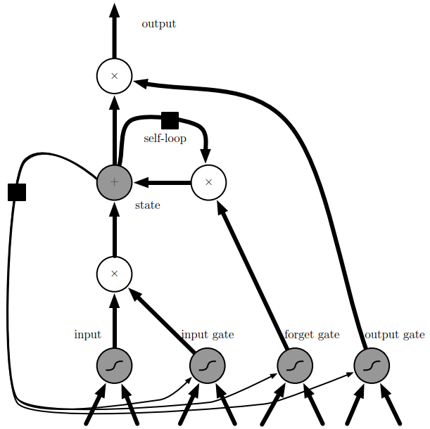

# Gated Recurrent Neural Networks
Like leaky units, **gated RNNs** are based on the idea of creating paths through time that have derivatives that neither vanish nor explode. Leaky units did this with connection weights that were either manually chosen constants or were parameters. Gated RNNs generalize this to connection weights that may change at each timestep.

Leaky units allow the network to accumulate information (such as evidence for a particular feature or category) over a long duration. Once that information has been used, however, it might be useful for the neural network to forget the old state. For example, if a sequence is made of subsequences and we want a leaky unit to accumulate evidence inside each sub-subsequence, we need a mechanism to forget the old state by setting it to zero. Instead of manually deciding when to clear the state, we want the neural network to learn to decide when to do it. This is what gated RNNs do.[^deeplearning]

## Long short-term memory
[Wikipedia](https://en.wikipedia.org/wiki/Long_short-term_memory)

**Long short-term memory** introduces self-loops to produce paths where the gradient
can flow for long durations. By making the weight of this self-loop gated (controlled by another hidden unit), the time scale of integration can be changed dynamically.

The LSTM cell internal state is updated as follows:

$$s_i^{(t)} =
f_i^{(t)} s_i^{(t-1)}
+ g_i^{(t)}\text{tanh}(b_i + \sum_j{U_{i,j}x_j^{(t)}}
+ \sum_j{W_{i,j} h_j^{(t-1)}})$$

where $b$, $U$ and $W$ respectively denote the biases, input weights, and recurrent weights into the LSTM cell. 状态更新通常使用的是 $\text{tanh}$，但 Deep Learning[^deeplearning] 中使用的是 $\sigma$.

The **forget gate** $f_i^{(t)}$ controlls the self-loop weight:
$$f_i^{(t)}=
\sigma(b_i^f + \sum_j{U_{i,j}^f x_j^{(t)}}
+ \sum_j{W_{i,j}^f h_j^{(t-1)}})$$

The **external input gate** unit $g_i^{(t)}$ is computed similarly to the forget gate, but with its own parameters:

$$g_i^{(t)}=
\sigma(b_i^g + \sum_j{U_{i,j}^g x_j^{(t)}}
+ \sum_j{W_{i,j}^g h_j^{(t-1)}})$$

The output $h_i^{(t)}$ of the LSTM cell that can also be shut off, via the **output gate** $q_i^{(t)}$, which also uses a sigmoid unit for gating:

$$\begin{align}
h_i^{(t)}&=\text{tanh}(s_i^{(t)})q_i^{(t)} \\
q_i^{(t)}&=
\sigma(b_i^o + \sum_j{U_{i,j}^o x_j^{(t)}}
+ \sum_j{W_{i,j}^o h_j^{(t-1)}})
\end{align}$$

Among the variants, one can choose to use the cell state $s_i^{(t)}$ as an extra input (with its weight) into the three gates of the $i$-th unit. This would require three additional parameters.

LSTM networks have been shown to learn long-term dependencies more easily than the simple recurrent architecture. The LSTM has been found extremely successful in many applications.[^deeplearning]

Examples:
- [pytorch-nlp-tutorial/sequence_classification_lstm.ipynb](https://github.com/epochx/pytorch-nlp-tutorial/blob/master/sequence_classification_lstm.ipynb)

Attention:
- [Attention in Long Short-Term Memory Recurrent Neural Networks - MachineLearningMastery.com](https://machinelearningmastery.com/attention-long-short-term-memory-recurrent-neural-networks/)

## Gated recurrent units
[Wikipedia](https://en.wikipedia.org/wiki/Gated_recurrent_unit)

The main difference between GRUs and the LSTM is that a single gating unit simultaneously controls the forgetting factor and the decision to update the state unit. The update equations are the following:

$$h_i^{(t)}=
u_i^{(t-1)} h_i^{(t-1)}
+ (1-u_i^{(t-1)})\sigma(b_i + \sum_j{U_{i,j}x_j^{(t-1)}}
+ \sum_j{W_{i,j} r_j^{(t-1)} h_j^{(t-1)}})$$

where $u$ stands for **update gate** and $r$ for **reset gate**. Their value is defined as usual:

$$\begin{align}
u_i^{(t)}&=
\sigma(b_i^u + \sum_j{U_{i,j}^u x_j^{(t)}}
+ \sum_j{W_{i,j}^u h_j^{(t-1)}}) \\
r_i^{(t)}&=
\sigma(b_i^r + \sum_j{U_{i,j}^r x_j^{(t)}}
+ \sum_j{W_{i,j}^r h_j^{(t-1)}})
\end{align}$$

The reset and update gates can individually “ignore” parts of the state vector. The **update gates** act like conditional leaky integrators that can linearly gate any dimension, thus choosing to copy it (at one extreme of the sigmoid) or completely ignore it (at the other extreme) by replacing it with the new “target state” value (toward which the leaky integrator wants to converge). The **reset gates** control which parts of the state get used to compute the next target state, introducing an additional nonlinear effect in the relationship between past state and future state.[^deeplearning]

GRU 中的 update gate 相当于 LSTM 中的 forget gate，$1 - \text{update gate}$ 相当于 input gate，reset gate 相当于 output gate。

Many more variants around this theme can be designed. For example the reset gate (or forget gate) output could be shared across multiple hidden units. Alternately, the product of a global gate (covering a whole group of units, such as an entire layer) and a local gate (per unit) could be used to combine global control and local control. Several investigations over architectural variations of the LSTM and GRU, however, found no variant that would clearly beat both of these across a wide range of tasks. Greff et al. (2015) found that a crucial ingredient is the forget gate, while Jozefowicz et al. (2015) found that adding a bias of $1$ to the LSTM forget gate, a practice advocated by Gers et al. (2000), makes the LSTM as strong as the best of the explored architectural variants.[^deeplearning]

[neural network - When to use GRU over LSTM? - Data Science Stack Exchange](https://datascience.stackexchange.com/questions/14581/when-to-use-gru-over-lstm)
- 由于 GRU 只有两个 gate，更容易训练，在算力不充足时 GRU 的表现可能比 LSTM 更好。
- LSTM 的理论记忆力比 GRU 更强。

[^deeplearning]: Goodfellow, Ian, Yoshua Bengio, and Aaron Courville. _Deep Learning_. MIT Press, 2016.