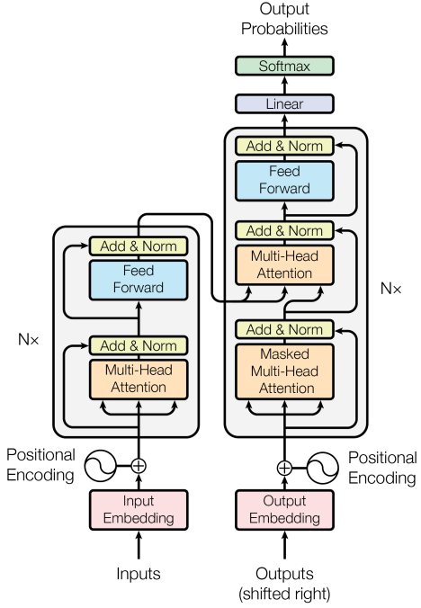

# Transformer
[Wikipedia](https://en.wikipedia.org/wiki/Transformer_(machine_learning_model))

**Transformer** is a model architecture eschewing recurrence and instead relying entirely on an attention mechanism to draw global dependencies between input and output.[^allyouneed]

[What Are Transformer Models and How Do They Work?](https://txt.cohere.com/what-are-transformer-models/)

[Transformers from Scratch](https://e2eml.school/transformers.html)

## Tokens
2022-10-17 [Token Merging: Your ViT but Faster](https://github.com/facebookresearch/ToMe)
- 2023-03-30 [Token Merging for Fast Stable Diffusion](https://github.com/dbolya/tomesd)
  - [ToMe extension for Stable Diffusion A1111 WebUI](https://github.com/SLAPaper/a1111-sd-webui-tome)

[^allyouneed]: Vaswani, Ashish, Noam Shazeer, Niki Parmar, Jakob Uszkoreit, Llion Jones, Aidan N. Gomez, Lukasz Kaiser, and Illia Polosukhin. “Attention Is All You Need.” arXiv, December 5, 2017. [https://doi.org/10.48550/arXiv.1706.03762](https://doi.org/10.48550/arXiv.1706.03762).