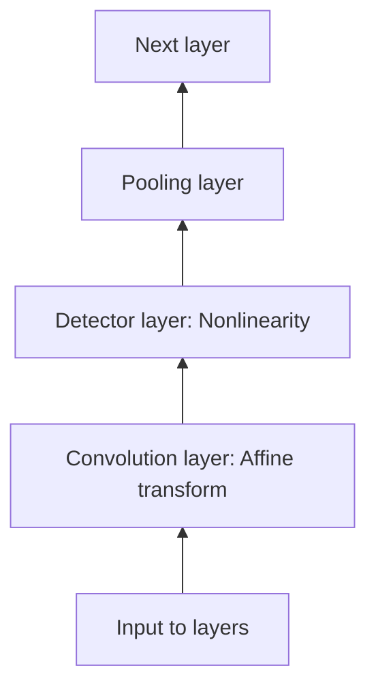

# Convolutional Neural Networks
[Wikipedia](https://en.wikipedia.org/wiki/Convolutional_neural_network)

**Convolutional neural networks** are simply neural networks that use convolution in place of general matrix multiplication in at least one of their layers.

We can imagine a convolutional net as being similar to a fully connected net, but with an **infinitely strong prior** over its weights. This infinitely strong prior says that the weights for one hidden unit must be identical to the weights of its neighbor but shifted in space. The prior also says that the weights must be zero, except for in the small, spatially contiguous receptive field assigned to that hidden unit. Overall, we can think of the use of convolution as introducing an infinitely strong prior probability distribution over the parameters of a layer. This prior says that the function the layer should learn contains only local interactions and is equivariant to translation. Likewise, the use of pooling is an infinitely strong prior that each unit should be invariant to small translations.

CNN 适用于具有 grid-like topology 的数据，例如 time-series data 和 image data。

Convolution leverages three important ideas that can help improve a machine learning system[^deeplearning]:
- Sparse interactions (sparse connectivity, sparse weights)

  This means that we need to store fewer parameters, which both reduces the memory requirements of the model and improves its statistical efficiency. It also means that computing the output requires fewer operations.

- Parameter sharing

  Parameter sharing refers to using the same parameter for more than one function in a model. In a convolutional neural net, each member of the kernel is used at every position of the input (except perhaps some of the boundary pixels, depending on the design decisions regarding the boundary). Convolution is thus dramatically more efficient than dense matrix multiplication in terms of the memory requirements and statistical efficiency.

- Equivariant representations

  To say a function is equivariant means that if the input changes, the output changes in the same way. Specifically, a function $f(x)$ is equivariant to a function g if $f(g(x)) = g(f(x))$. In the case of convolution, if we let $g$ be any function that translates the input, that is, shifts it, then the convolution function is equivariant to $g$.

  For example, when processing images, it is useful to detect edges in the first layer of a convolutional network. The same edges appear more or less everywhere in the image, so it is practical to share parameters across the entire image.  In some cases, we may not wish to share parameters across the entire image. For example, if we are processing images that are cropped to be centered on an individual’s face, we probably want to extract different features at different locations—the part of the network processing the top of the face needs to look for eyebrows, while the part of the network processing the bottom of the face needs to look for a chin.

  Convolution is not naturally equivariant to some other transformations, such as changes in the scale or rotation of an image. Other mechanisms are necessary for handling these kinds of transformations.

Moreover, convolution provides a means for working with inputs of variable size.

We should only compare convolutional models to other convolutional models in benchmarks of statistical learning performance. Models that do not use convolution would be able to learn even if we permuted all the pixels in the image.

## Convolution
Given $x(t)$, the convolution operation is
$$s(t)=\int {x(a)w(t-a)da}$$
which is typically denoted with an asterisk:
$$s(t)=(x\ast w)(t)$$
where $x$ is the **input**, $w$ is the **kernel**, a weighting function, $s$ is the **output (feature map)**.

Convolutions can be used over more than one axis at a time:

$$S(i,j)=(I\ast K)(i,j)=\sum_m\sum_n I(m,n)K(i-m,j-n)$$

Convolution is commutative, meaning we can equivalently write

$$S(i,j)=(K\ast I)(i,j)=\sum_m\sum_n I(i-m,j-n)K(m,n)$$

The commutative property of convolution arises because we have **flipped** the kernel relative to the input, in the sense that as $m$ increases, the index into the input increases, but the index into the kernel decreases. While the commutative property is useful for writing proofs, it is not usually an important property of a neural network implementation. Instead, many neural network libraries implement a related function called the **cross-correlation (often called convolution)**, which is the same as convolution but without flipping the kernel:

$$S(i,j)=(I\ast K)(i,j)=\sum_m\sum_n I(i+m,j+n)K(m,n)$$

Discrete convolution can be viewed as multiplication by a matrix, but the matrix has several entries constrained to be equal to other entries. For example, for univariate discrete convolution, each row of the matrix is constrained to be equal to the row above shifted by one element. This is known as a **Toeplitz matrix**. In two dimensions, a **doubly block circulant matrix** corresponds to convolution.[^deeplearning]

## Pooling

A **pooling** function replaces the output of the net at a certain location with a summary statistic of the nearby outputs. Pooling helps to make the representation approximately invariant to small translations of the input. Invariance to local translation can be a useful property if we care more about whether some feature is present than exactly where it is.

The use of pooling can be viewed as adding an infinitely strong prior that the function the layer learns must be invariant to small translations. When this assumption is correct, it can greatly improve the statistical efficiency of the network.

For many tasks, pooling is essential for handling inputs of varying size. For example, if we want to classify images of variable size, the input to the classification layer must have a fixed size. This is usually accomplished by varying the size of an offset between pooling regions so that the classification layer always receives the same number of summary statistics regardless of the input size.

Pooling 和 image scaling 都可以用于将图像转换到指定大小，两者在一定程度上是等价的。

[^deeplearning]: Goodfellow, Ian, Yoshua Bengio, and Aaron Courville. _Deep Learning_. MIT Press, 2016.