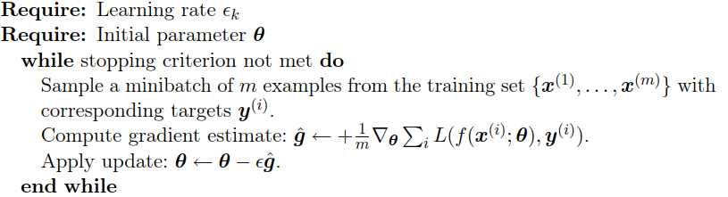
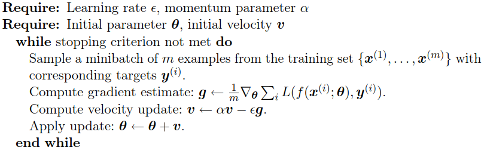
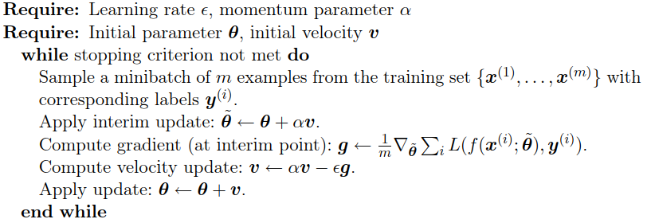
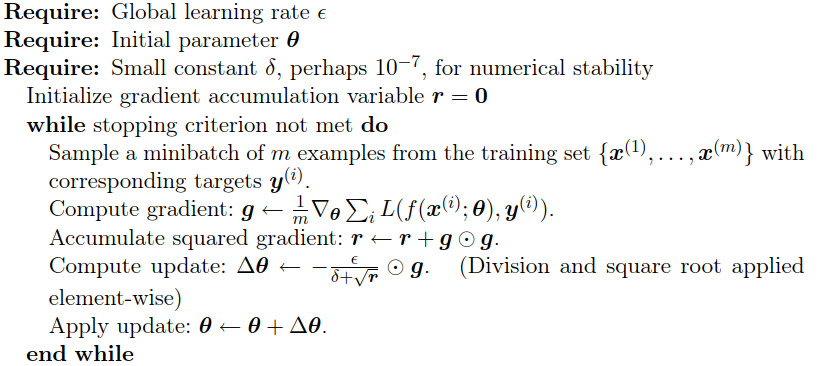
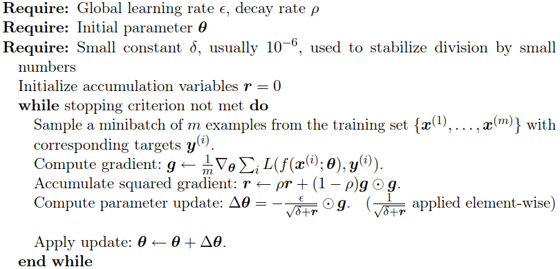
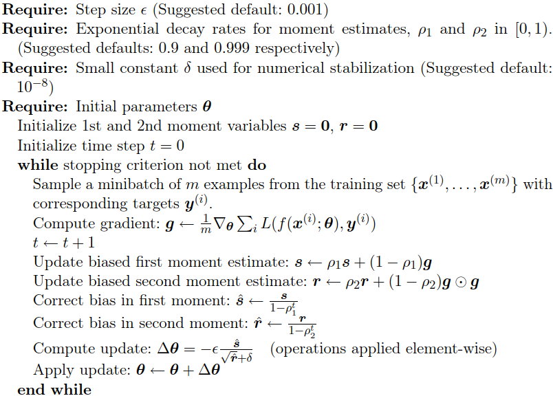

# Optimization Algorithms
Which algorithm should one choose? Unfortunately, there is currently no consensus on this point. Schaul et al. (2014) presented a valuable comparison of a large number of optimization algorithms across a wide range of learning tasks. While the results suggest that the family of algorithms with adaptive learning rates (represented by RMSProp and AdaDelta) performed fairly robustly, no single best algorithm has emerged.

Currently, the most popular optimization algorithms actively in use include SGD, SGD with momentum, RMSProp, RMSProp with momentum, AdaDelta, and Adam. The choice of which algorithm to use, at this point, seems to depend largely on the user’s familiarity with the algorithm (for ease of hyperparameter tuning).[^deeplearning]

## Batch and minibatch algorithms
One aspect of machine learning algorithms that separates them from general optimization algorithms is that the objective function usually decomposes as a sum over the training examples.

$$J(\theta)=E_{(x,y)\sim \hat{p}_{data}} L(f(x;\theta),y)$$

Computing this expectation exactly is very expensive because it requires evaluating the model on every example in the entire dataset. In practice, we can compute these expectations by randomly sampling a small number of examples from the dataset, then taking the average over only those examples:
- Most optimization algorithms converge much faster (in terms of total computation, not in terms of number of updates) if they are allowed to rapidly compute approximate estimates of the gradient rather than slowly computing the exact gradient.
- Another consideration motivating statistical estimation of the gradient from a small number of samples is redundancy in the training set.

Optimization algorithms that use the entire training set are called **batch** or **deterministic** gradient methods, because they process all the training examples simultaneously in a large batch. This terminology can be somewhat confusing because the word “batch” is also often used to describe the minibatch used by minibatch stochastic gradient descent. Typically the term “batch gradient descent” implies the use of the full training set, while the use of the term “batch” to describe a group of examples does not. For example, it is common to use the term “batch size” to describe the size of a minibatch.

Optimization algorithms that use only a single example at a time are sometimes called **stochastic** and sometimes **online** methods. The term “online” is usually reserved for when the examples are drawn from a stream of continually created examples rather than from a fixed-size training set over which several passes are made.

Most algorithms used for deep learning fall somewhere in between, using more than one but fewer than all the training examples. These were traditionally called **minibatch** or **minibatch stochastic** methods, and it is now common to call them simply **stochastic** methods.

Minibatch sizes are generally driven by the following factors:
- Larger batches provide a more accurate estimate of the gradient, but with less than linear returns.
- Multicore architectures are usually underutilized by extremely small batches. This motivates using some absolute minimum batch size, below which there is no reduction in the time to process a minibatch.
-  If all examples in the batch are to be processed in parallel (as is typically the case), then the amount of memory scales with the batch size. For many hardware setups this is the limiting factor in batch size.
- Some kinds of hardware achieve better runtime with specific sizes of arrays. Especially when using GPUs, it is common for power of 2 batch sizes to offer better runtime. Typical power of 2 batch sizes range from 32 to 256, with 16 sometimes being attempted for large models.
- Small batches can offer a regularizing effect, perhaps due to the noise they add to the learning process. Generalization error is often best for a batch size of $1$. Training with such a small batch size might require a small learning rate to maintain stability because of the high variance in the estimate of the gradient. The total runtime can be very high as a result of the need to make more steps, both because of the reduced learning rate and because it takes more steps to observe the entire training set.

Different kinds of algorithms use different kinds of information from the minibatch in various ways. Some algorithms are more sensitive to sampling error than others, either because they use information that is difficult to estimate accurately with few samples, or because they use information in ways that amplify sampling errors more. Methods that compute updates based only on the gradient $g$ are usually relatively robust and can handle smaller batch sizes, like $100$.

It is also crucial that the minibatches be selected randomly. Computing an unbiased estimate of the expected gradient from a set of samples requires that those samples be independent. Many datasets are most naturally arranged in a way where successive examples are highly correlated. In cases where the order of the dataset holds some significance, it is necessary to shuffle the examples before selecting minibatches.

When using an extremely large training set, overfitting is not an issue, so underfitting and computational efficiency become the predominant concerns.[^deeplearning]

## Stochastic gradient descent
**Stochastic gradient descent (SGD)** and its variants are probably the most used optimization algorithms for machine learning in general and for deep learning in particular. It is possible to obtain an unbiased estimate of the gradient by taking the average gradient on a minibatch of $m$ examples drawn i.i.d from the data-generating distribution.[^deeplearning]

### Learning rates
A crucial parameter for the SGD algorithm is the **learning rate**. In practice, it is necessary to gradually decrease the learning rate over time, so we denote the learning rate at iteration $k$ as $\epsilon_k$. This is because the SGD gradient estimator introduces a source of noise (the random sampling of m training examples) that does not vanish even when we arrive at a minimum. By comparison, the true gradient of the total cost function becomes small and then $0$ when we approach and reach a minimum using batch gradient descent, so batch gradient descent can use a fixed learning rate. A sufficient condition to guarantee convergence of SGD is that

$$\begin{align}
\sum_{k=1}^\infty {\epsilon_k} &= \infty \\
\sum_{k=1}^\infty {\epsilon_k^2} &< \infty
\end{align}$$

In practice, it is common to decay the learning rate linearly until iteration $\tau$:

$$\epsilon_k=(1-a)\epsilon_0+a\epsilon_\tau$$

with $a={k\over\tau}$. After iteration $\tau$, it is common to leave $\epsilon$ constant.

When using the linear schedule, the parameters to choose are $\epsilon_0$, $\epsilon_\tau$, and $\tau$. Usually $\tau$ may be set to the number of iterations required to make a few hundred passes through the training set. Usually $\epsilon_\tau$ should be set to roughly $1$ percent the value of $\epsilon_0$. The main question is how to set $\epsilon_0$. If it is too large, the learning curve will show violent oscillations, with the cost function often increasing significantly. Gentle oscillations are fine, especially if training with a stochastic cost function, such as the cost function arising from the use of dropout. If the learning rate is too low, learning proceeds slowly, and if the initial learning rate is too low, learning may become stuck with a high cost value.

The learning rate may be chosen by trial and error, but it is usually best to choose it by monitoring learning curves that plot the objective function as a function of time. Typically, the optimal initial learning rate, in terms of total training time and the final cost value, is higher than the learning rate that yields the best performance after the first 100 iterations or so. Therefore, it is usually best to monitor the first several iterations and use a learning rate that is higher than the best-performing learning rate at this time, but not so high that it causes severe instability. This is more of an art than a science, and most guidance on this subject should be regarded with some skepticism.

To study the convergence rate of an optimization algorithm it is common to measure the excess error $J(\theta) − \text{min}_\theta {J(\theta)}$, which is the amount by which the current cost function exceeds the minimum possible cost. When SGD is applied to a convex problem, the excess error is $O({1\over\sqrt k})$ after $k$ iterations, while in the strongly convex case, it is $O({1\over k})$. These bounds cannot be improved unless extra conditions are assumed. Batch gradient descent enjoys better convergence rates than stochastic gradient descent in theory. However, the Cramér-Rao bound states that generalization error cannot decrease faster than $O({1\over k})$. Bottou and Bousquet (2008) argue that it therefore may not be worthwhile to pursue an optimization algorithm that converges faster than $O({1\over k})$ for machine learning tasks—faster convergence presumably corresponds to overfitting.

Moreover, the asymptotic analysis obscures many advantages that stochastic gradient descent has after a small number of steps. With large datasets, the ability of SGD to make rapid initial progress while evaluating the gradient for very few examples outweighs its slow asymptotic convergence. One can also trade off the benefits of both batch and stochastic gradient descent by gradually increasing the minibatch size during the course of learning.[^deeplearning]

## Momentum
The method of momentum is designed to accelerate learning, especially in the face of high curvature, small but consistent gradients, or noisy gradients. The momentum algorithm accumulates an exponentially decaying moving average of past gradients and continues to move in their direction.

Common values of $a$ used in practice include $0.5$, $0.9$, and $0.99$. Like the learning rate, $a$ may also be adapted over time. Typically it begins with a small value and is later raised. Adapting $a$ over time is less important than shrinking $\epsilon$ over time.[^deeplearning]

### Nesterov momentum

The difference between Nesterov momentum and standard momentum is where the gradient is evaluated. With Nesterov momentum, the gradient is evaluated after the current velocity is applied. Thus one can interpret Nesterov momentum as attempting to add a correction factor to the standard method of momentum.

In the convex batch gradient case, Nesterov momentum brings the rate of convergence of the excess error from $O({1\over k})$ (after $k$ steps) to $O({1\over k^2})$. Unfortunately, in the stochastic gradient case, Nesterov momentum does not improve the rate of convergence.[^deeplearning]

## Algorithms with adaptive learning rates
Neural network researchers have long realized that the learning rate is reliably one of the most difficult to set hyperparameters because it significantly affects model performance. The cost is often highly sensitive to some directions in parameter space and insensitive to others. The momentum algorithm can mitigate these issues somewhat, but it does so at the expense of introducing another hyperparameter. In the face of this, it is natural to ask if there is another way. If we believe that the directions of sensitivity are somewhat axis aligned, it can make sense to use a separate learning rate for each parameter and automatically adapt these learning rates throughout the course of learning.

The **delta-bar-delta** algorithm (Jacobs, 1988) is an early heuristic approach to adapting individual learning rates for model parameters during training. The approach is based on a simple idea: if the partial derivative of the loss, with respect to a given model parameter, remains the same sign, then the learning rate should increase. If that partial derivative changes sign, then the learning rate should decrease. Of course, this kind of rule can only be applied to full batch optimization. More recently, a number of incremental (or mini batch-based) methods have
been introduced that adapt the learning rates of model parameters.[^deeplearning]

### AdaGrad
The **AdaGrad** algorithm individually adapts the learning rates of all model parameters by scaling them inversely proportional to the square root of the sum of all the historical squared values of the gradient (Duchi et al., 2011). The parameters with the largest partial derivative of the loss have a correspondingly rapid decrease in their learning rate, while parameters with small partial derivatives have a relatively small decrease in their learning rate. The net effect is greater progress in the more gently sloped directions of parameter space.

In the context of convex optimization, the AdaGrad algorithm enjoys some desirable theoretical properties. Empirically, however, for training deep neural network models, the accumulation of squared gradients from the beginning of training can result in a premature and excessive decrease in the effective learning rate. AdaGrad performs well for some but not all deep learning models.[^deeplearning]

### RMSProp
The **RMSProp** algorithm (Hinton, 2012) modifies AdaGrad to perform better in the nonconvex setting by changing the gradient accumulation into an exponentially weighted moving average. AdaGrad is designed to converge rapidly when applied to a convex function. When applied to a nonconvex function to train a neural network, the learning trajectory may pass through many different structures and eventually arrive at a region that is a locally convex bowl. AdaGrad shrinks the learning rate according to the entire history of the squared gradient and may have made the learning rate too small before arriving at such a convex structure. RMSProp uses an exponentially decaying average to discard history from the extreme past so that it can converge rapidly after finding a convex bowl, as if it were an instance of the AdaGrad algorithm initialized within that bowl.

Compared to AdaGrad, the use of the moving average introduces a new hyperparameter, $\rho$, that controls the length scale of the moving average.

Empirically, RMSProp has been shown to be an effective and practical optimization algorithm for deep neural networks. It is currently one of the go-to optimization methods being employed routinely by deep learning practitioners.[^deeplearning]

### Adam
**Adam (adaptive moments)** (Kingma and Ba, 2014) is yet another adaptive learning rate optimization algorithm. In the context of the earlier algorithms, it is perhaps best seen as a variant on the combination of RMSProp and momentum with a few important distinctions. First, in Adam, momentum is incorporated directly as an estimate of the first-order moment (with exponential weighting) of the gradient. The most straightforward way to add momentum to RMSProp is to apply momentum to the rescaled gradients. The use of momentum in combination with rescaling does not have a clear theoretical motivation. Second, Adam includes bias corrections to the estimates of both the first-order moments (the momentum term) and the (uncentered) second-order moments to account for their initialization at the origin. RMSProp also incorporates an estimate of the (uncentered) second-order moment; however, it lacks the correction factor. Thus, unlike in Adam, the RMSProp second-order moment estimate may have high bias early in training.

Adam is generally regarded as being fairly robust to the choice of hyperparameters, though the learning rate sometimes needs to be changed from the suggested default.[^deeplearning]

[^deeplearning]: Goodfellow, Ian, Yoshua Bengio, and Aaron Courville. _Deep Learning_. MIT Press, 2016.