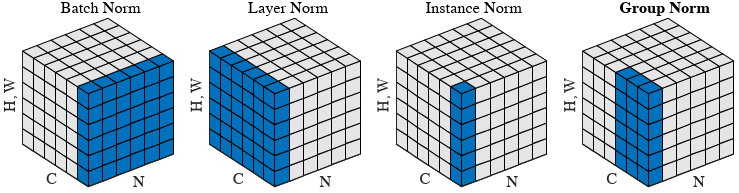

# Normalization

where each subplot shows a feature map tensor, with $N$ as the batch axis, $C$ as the channel axis, and $(H, W)$ as the spatial axes. The pixels in blue are normalized by the same mean and variance, computed by aggregating the values of these pixels.[^group]

[machine learning - Why do transformers use layer norm instead of batch norm? - Cross Validated](https://stats.stackexchange.com/questions/474440/why-do-transformers-use-layer-norm-instead-of-batch-norm)

[machine learning - Instance Normalisation vs Batch normalisation - Stack Overflow](https://stackoverflow.com/questions/45463778/instance-normalisation-vs-batch-normalisation)

## Batch normalization
[Wikipedia](https://en.wikipedia.org/wiki/Batch_normalization)

Very deep models involve the composition of several functions, or layers. The gradient tells how to update each parameter, under the assumption that the other layers do not change. In practice, we update all the layers simultaneously. When we make the update, unexpected results can happen because many functions composed together are changed simultaneously, using updates that were computed under the assumption that the other functions remain constant.

Batch normalization provides an elegant way of reparametrizing almost any deep network. The reparametrization significantly reduces the problem of coordinating updates across many layers. Batch normalization can be applied to any input or hidden layer in a network. Let $H$ be a minibatch of activations of the layer to normalize, arranged as a design matrix, with the activations for each example appearing in a row of the matrix. To normalize $H$, we replace it with

$$H'={H-\mu \over \sigma}$$

where $\mu$ is a vector containing the mean of each unit and $\sigma$ is a vector containing the standard deviation of each unit. The arithmetic here is based on broadcasting the vector $\mu$ and the vector $\sigma$ to be applied to every row of the matrix $H$. Within each row, the arithmetic is element-wise, so $H_{i,j}$ is normalized by subtracting $\mu_j$ and dividing by $\sigma_j$. The rest of the network then operates on $H'$ in exactly the same way that the original network operated on $H$.

Crucially, we back-propagate through these operations for computing the mean and the standard deviation, and for applying them to normalize $H$. This means that the gradient will never propose an operation that acts simply to increase the standard deviation or mean of $h_i$; the normalization operations remove the effect of such an action and zero out its component in the gradient. This was a major innovation of the batch normalization approach. Previous approaches had involved adding penalties to the cost function to encourage units to have normalized activation statistics or involved intervening to renormalize unit statistics after each gradient descent step. The former approach usually resulted in imperfect normalization and the latter usually resulted in significant wasted time, as the learning algorithm repeatedly proposed changing the mean and variance, and the normalization step repeatedly undid this change. Batch normalization reparametrizes the model to make some units always be standardized by definition, deftly sidestepping both problems.

In a deep neural network with nonlinear activation functions, the lower layers can perform nonlinear transformations of the data, so they remain useful. Batch normalization acts to standardize only the mean and variance of each unit in order to stabilize learning, but it allows the relationships between units and the nonlinear statistics of a single unit to change.

Because the final layer of the network is able to learn a linear transformation, we may actually wish to remove all linear relationships between units within a layer. Unfortunately, eliminating all linear interactions is much more expensive than standardizing the mean and standard deviation of each individual unit, and so far batch normalization remains the most practical approach.

Normalizing the mean and standard deviation of a unit can reduce the expressive power of the neural network containing that unit. To maintain the expressive power of the network, it is common to replace the batch of hidden unit activations $H$ with $\gamma H′ + \beta$ rather than simply the normalized $H'$. The variables $\gamma$ and $\beta$ are learned parameters that allow the new variable to have any mean and standard deviation. In the old parametrization, the mean of $H$ was determined by a complicated interaction between the parameters in the layers below $H$. In the new parametrization, the mean of $\gamma H′ + \beta$ is determined solely by $\beta$. The new parametrization is much easier to learn with gradient descent.

The primary purpose of batch normalization is to improve optimization, but the noise can have a regularizing effect, and sometimes makes dropout unnecessary.

In convolutional networks, it is important to apply the same normalizing $\mu$ and $\sigma$ at every spatial location within a feature map, so that the statistics of the feature map remain the same regardless of spatial location.[^deeplearning]

## Layer normalization
Batch normalization uses the distribution of the summed input to a neuron over a mini-batch of training cases to compute a mean and variance which are then used to normalize the summed input to that neuron on each training case. This significantly reduces the training time in feed-forward neural networks. However, the effect of batch normalization is dependent on the mini-batch size and it is not obvious how to apply it to recurrent neural networks. We transpose batch normalization into **layer normalization** by computing the mean and variance used for normalization from all of the summed inputs to the neurons in a layer on a single training case. 

Like batch normalization, we also give each neuron its own adaptive bias and gain which are applied after the normalization but before the non-linearity. Unlike batch normalization, layer normalization performs exactly the same computation at training and test times. It is also straightforward to apply to recurrent neural networks by computing the normalization statistics separately at each time step. Layer normalization is very effective at stabilizing the hidden state dynamics in recurrent networks. Empirically, we show that layer normalization can substantially reduce the training time compared with previously published techniques.[^layer]

## Instance normalization

## Weight normalization

[^deeplearning]: Goodfellow, Ian, Yoshua Bengio, and Aaron Courville. _Deep Learning_. MIT Press, 2016.
[^group]: Wu, Yuxin, and Kaiming He. “Group Normalization.” arXiv, June 11, 2018. [https://doi.org/10.48550/arXiv.1803.08494](https://doi.org/10.48550/arXiv.1803.08494).
[^layer]: Ba, Jimmy Lei, Jamie Ryan Kiros, and Geoffrey E. Hinton. “Layer Normalization.” arXiv, July 21, 2016. [https://doi.org/10.48550/arXiv.1607.06450](https://doi.org/10.48550/arXiv.1607.06450).