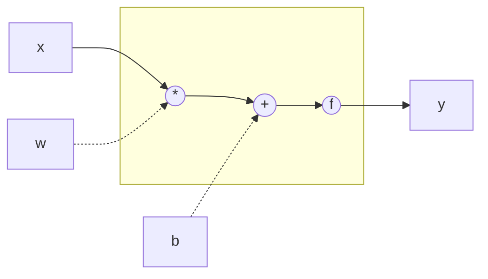

# Artificial Neural Networks

```mermaid
flowchart LR
    x --> mul((*))
    w -.-> mul
    mul --> plus((+))
    b -.-> plus
    plus --> f((f)) --> y

    subgraph  
    mul & plus & f
    end
```
