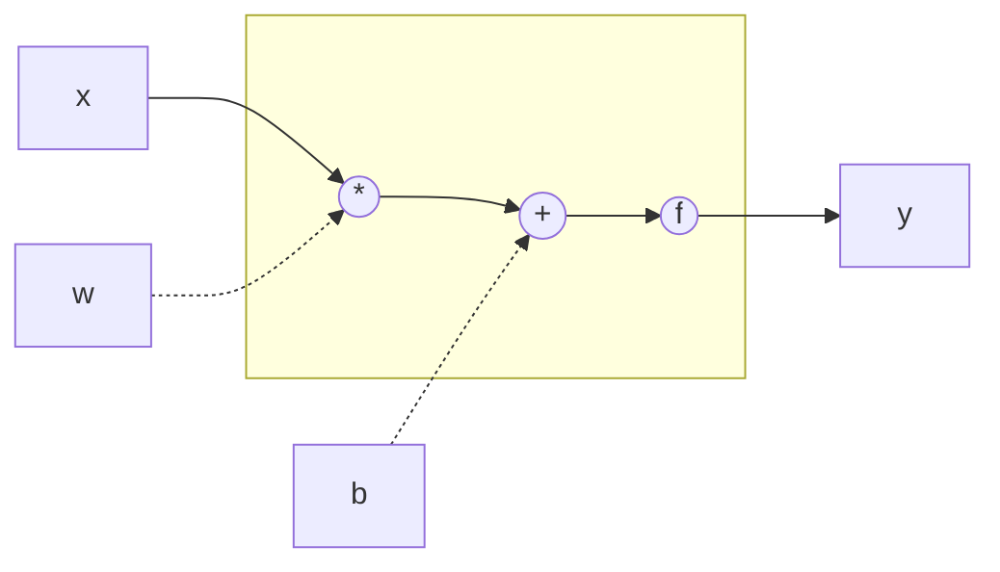

# Artificial Neural Networks
[Wikipedia](https://en.wikipedia.org/wiki/Artificial_neural_network)

## Universal approximation theorem
[Wikipedia](https://en.wikipedia.org/wiki/Universal_approximation_theorem)

The **universal approximation theorem** states that a feedforward network with a linear output layer and at least one hidden layer with any “squashing” activation function (such as the logistic sigmoid activation function) can approximate any Borel measurable function from one finite-dimensional space to another with any desired nonzero amount of error, provided that the network is given enough hidden units. The derivatives of the feedforward network can also approximate the derivatives of the function arbitrarily well. A neural network may also approximate any function mapping from any finite dimensional discrete space to another.

We are not guaranteed, however, that the training algorithm will be able to learn that function. Even if the MLP is able to represent the function, learning can fail for two different reasons:
- First, the optimization algorithm used for training may not be able to find the value of the parameters that corresponds to the desired function.
- Second, the training algorithm might choose the wrong function as a result of overfitting.

In summary, a feedforward network with a single layer is sufficient to represent any function, but the layer may be infeasibly large and may fail to learn and generalize correctly. In many circumstances, using deeper models can reduce the number of units required to represent the desired function and can reduce the amount of generalization error.

Various families of functions can be approximated efficiently by an architecture with depth greater than some value $d$, but they require a much larger model if depth is restricted to be less than or equal to $d$. In many cases, the number of hidden units required by the shallow model is exponential in $n$.

We may also want to choose a deep model for statistical reasons. Any time we choose a specific machine learning algorithm, we are implicitly stating some set of prior beliefs we have about what kind of function the algorithm should learn. Choosing a deep model encodes a very general belief that the function we want to learn should involve composition of several simpler functions. This can be interpreted from a representation learning point of view as saying that we believe the learning problem consists of discovering a set of underlying factors of variation that can in turn be described in terms of other, simpler underlying factors of variation. Alternately, we can interpret the use of a deep architecture as expressing a belief that the function we want to learn is a computer program consisting of multiple steps, where each step makes use of the previous step’s output. These intermediate outputs are not necessarily factors of variation but can instead be analogous to counters or pointers that the network uses to organize its internal processing. Empirically, greater depth does seem to result in better generalization for a wide variety of tasks.[^deeplearning]

Universal approximation theorem 已经表明，简单的 FNN 就可以近似足够复杂的函数，那么 ANN 还要研究什么呢？尽管简单的 FNN 可以近似足够复杂的函数，但这所需要的计算量常常是非常巨大的，ANN 的研究内容实际上不是提高 ANN 的近似能力，而是提高 ANN 的计算性能。从这里开始，ANN 就从理论学科变成了实践学科。

## Deep learning
Challenges motivating deep learning:
- The curse of dimensionality
- Local constancy and smoothness regularization
- Manifold learning

## Performance
- [PyTorch](PyTorch/README.md)
  - [Distributed Data Parallel](https://pytorch.org/tutorials/intermediate/ddp_tutorial.html)
  - [FairScale: PyTorch extensions for high performance and large scale training.](https://github.com/facebookresearch/fairscale)
  - [Hivemind: Decentralized deep learning in PyTorch. Built to train models on thousands of volunteers across the world.](https://github.com/learning-at-home/hivemind)
  - [PyTorch Large Model Support](https://github.com/IBM/pytorch-large-model-support)
  - [The Torch-MLIR project: aims to provide first class support from the PyTorch ecosystem to the MLIR ecosystem.](https://github.com/llvm/torch-mlir/)
  - [PyTorch/XLA: Enabling PyTorch on Google TPU](https://github.com/pytorch/xla)
- [Lightning: Deep learning framework to train, deploy, and ship AI products Lightning fast.](https://github.com/Lightning-AI/lightning)
  - [Train 1 trillion+ parameter models](https://lightning.ai/docs/pytorch/latest/advanced/model_parallel.html)
  - [Introducing PyTorch Lightning Sharded: Train SOTA Models, With Half The Memory | by Sean Narenthiran | PyTorch | Medium](https://seannaren.medium.com/introducing-pytorch-lightning-sharded-train-sota-models-with-half-the-memory-7bcc8b4484f2)
  - [Colossal-AI](https://lightning.ai/docs/pytorch/stable/advanced/third_party/colossalai.html)

  [Pytorch Lightning 完全攻略 - 知乎](https://zhuanlan.zhihu.com/p/353985363)
- [ColossalAI: Making large AI models cheaper, faster and more accessible](https://github.com/hpcaitech/ColossalAI)

  Only Linux is supported for now.
- [DirectML: A high-performance, hardware-accelerated DirectX 12 library for machine learning](https://github.com/microsoft/DirectML)

  [Using AMD and Intel GPUs on Windows with Tensorflow DirectML | videogames.ai](https://www.videogames.ai/2020/06/11/AMD-Intel-GPU-Windows-Tensorflow-DirectML.html)

  [TensorFlow-DirectML AI Benchmark with Intel Integrated Graphics - SkatterBencher](https://skatterbencher.com/tensorflow-directml-ai-benchmark-with-intel-integrated-graphics/)
- [xFormers: Hackable and optimized Transformers building blocks, supporting a composable construction.](https://github.com/facebookresearch/xformers)

[How 🤗 Accelerate runs very large models thanks to PyTorch](https://huggingface.co/blog/accelerate-large-models)

## Information sources
Books:
- [Deep Learning](https://www.deeplearningbook.org/)

  好书，不过是 2016 年的，有一点旧了。
- [神经网络与深度学习](https://nndl.github.io/) ([GitHub](https://github.com/nndl/nndl.github.io))

  烂书。

[^deeplearning]: Goodfellow, Ian, Yoshua Bengio, and Aaron Courville. _Deep Learning_. MIT Press, 2016.