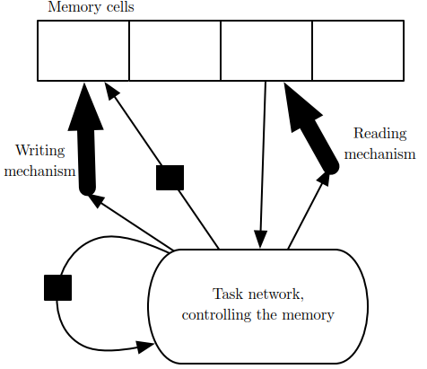

# Explicit Memory
Neural networks excel at storing implicit knowledge, but they struggle to memorize facts. Stochastic gradient descent requires many presentations of the same input before it can be stored in neural network parameters, and even then, that input will not be stored especially precisely. Graves et al. (2014b) hypothesized that this is because neural networks lack the equivalent of the **working memory** system that enables human beings to explicitly hold and manipulate pieces of information that are relevant to achieving some goal.

To resolve this difficulty, Weston et al. (2014) introduced **memory networks** that include a set of memory cells that can be accessed via an addressing mechanism. Memory networks originally required a supervision signal instructing them how to use their memory cells. Graves et al. (2014b) introduced the **neural Turing machine**, which is able to learn to read from and write arbitrary content to memory cells without explicit supervision about which actions to undertake, and allowed end-to-end training without this supervision signal, via the use of a content-based soft attention mechanism. This soft addressing mechanism has become standard with other related architectures, emulating algorithmic mechanisms in a way that still allows gradient-based optimization.

Each memory cell can be thought of as an extension of the memory cells in LSTMs and GRUs. The difference is that the network outputs an internal state that chooses which cell to read from or write to, just as memory accesses in a digital computer read from or write to a specific address.

Explicit memory seems to allow models to learn tasks that ordinary RNNs or LSTM RNNs cannot learn. One reason for this advantage may be that information and gradients can be propagated (forward in time or backward in time, respectively) for very long durations.

The mechanism for choosing an address is in its form identical to the attention mechanism.

[^deeplearning]: Goodfellow, Ian, Yoshua Bengio, and Aaron Courville. _Deep Learning_. MIT Press, 2016.