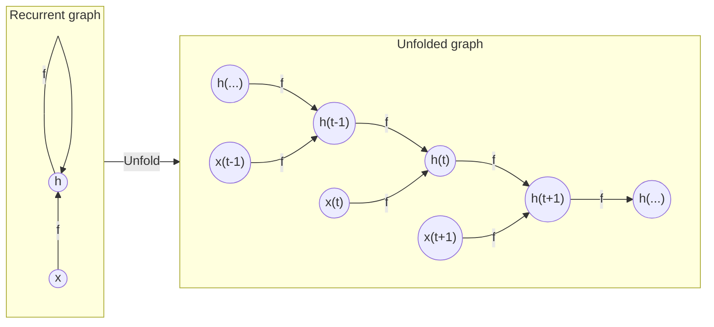
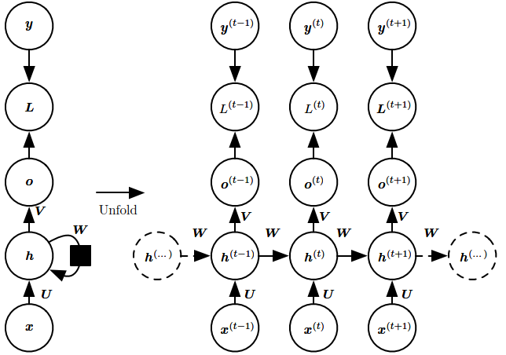
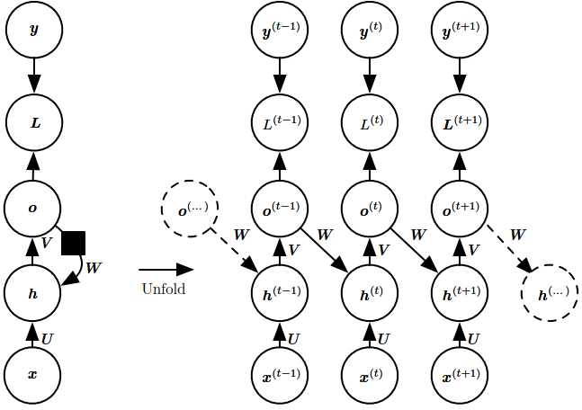
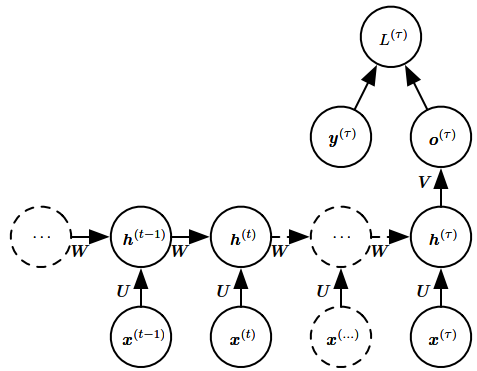
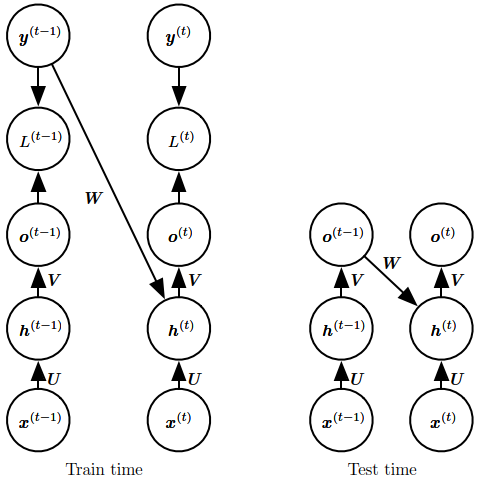

# Recurrent Neural Networks
Recurrent neural networks are a family of neural networks for processing sequential data.

Parameter sharing makes it possible to extend and apply the model to examples of different forms and generalize across them. The convolution operation allows a network to share parameters across time but is shallow. The output of convolution is a sequence where each member of the output is a function of a small number of neighboring members of the input. Recurrent networks share parameters in a different way. Each member of the output is a function of the previous members of the output. Each member of the output is produced using the same update rule applied to the previous outputs. This recurrent formulation results in the sharing of parameters through a very deep computational graph.

Recurrent neural networks can be built in many different ways. Much as almost any function can be considered a feedforward neural network, essentially any function involving recurrence can be considered a recurrent neural network.

Many recurrent neural networks use the following equation or a similar equation to define the values of their hidden unit:
$$h^{(t)}=f(h^{(t-1)},x^{(t)};\theta)$$

Typical RNNs will add extra architectural features such as output layers that read information out of the state $h$ to make predictions.

Some examples of important design patterns for recurrent neural networks include the following[^deeplearning]:
- Recurrent networks that produce an output at each time step and have recurrent connections between hidden units.

  
- Recurrent networks that produce an output at each time step and have recurrent connections only from the output at one time step to the hidden units at the next time step.

  
- Recurrent networks with recurrent connections between hidden units, that read an entire sequence and then produce a single output.

  

## Hidden-to-hidden
Recurrent networks that produce an output at each time step and have recurrent connections between hidden units.

The recurrent neural networks of this type is universal in the sense that any function computable by a Turing machine can be computed by such a recurrent network of a finite size. The functions computable by a Turing machine are discrete, so these results regard exact implementation of the function, not approximations.

Here we assume the hyperbolic tangent activation function and that the output is discrete. A natural way to represent discrete variables is to regard the output $o$ as giving the unnormalized log probabilities of each possible value of the discrete variable. We can then apply the softmax operation as a post-processing step to obtain a vector $\hat{y}$ of normalized probabilities over the output. Forward propagation begins with a specification of the initial state $h^{(0)}$. Then, for each time step from $t=1$ to $t=\tau$, we apply the following update equations:

$$\begin{align}
a^{(t)}&=b+Wh^{(t-1)}+Ux^{(t)} \\
h^{(t)}&=\text{tanh}(a^{(t)}) \\
o^{(t)}&=c+Vh^{(t)} \\
\hat{y}^{(t)}&=\text{softmax}(o^{(t)})
\end{align}$$

where the parameters are the bias vectors $b$ and $c$ along with the weight matrics $U$, $V$ and $W$, respectively, for input-to-hidden, hidden-to-output and hidden-to-hidden connections.

The total loss for a given sequence of $x$ values paired with a sequence of $y$ values would then be just the sum of the losses over all the time steps. For example, if $L^{(t)}$ is the negative log-likelihood of $y^{(t)}$ given $x^{(1)},\cdots,x^{(t)}$, then

$$\begin{align}
&L(\{x^{(1)},\cdots,x^{(\tau)}\},\{y^{(1)},\cdots,y^{(\tau)}\}) \\
&=\sum_t L^{(t)} \\
&=-\sum_t \log{p_{\text{model}} (y^{(t)} | \{x^{(1)},\cdots,x^{(t)}\} )}
\end{align}$$

Computing the gradient of this loss function with respect to the parameters is an expensive operation. The gradient computation involves performing a forward propagation pass moving left to right through the unrolled graph, followed by a backward propagation pass moving right to left through the graph. The runtime is $O(\tau)$ and cannot be reduced by parallelization because the forward propagation graph is inherently sequential; each time step may be computed only after the previous one. States computed in the forward pass must be stored until they are reused during the backward pass, so the memory cost is also $O(\tau)$. The back-propagation algorithm applied to the unrolled graph with $O(\tau)$ cost is called **back-propagation through time (BPTT)**.[^deeplearning]

## Output-to-hidden
Recurrent networks that produce an output at each time step and have recurrent connections only from the output at one time step to the hidden units at the next time step.

The recurrent network of this type is strictly less powerful because it lacks hidden-to-hidden recurrent connections. For example, it cannot simulate a universal Turing machine. Because this network lacks hidden-to-hidden recurrence, it requires that the output units capture all the information about the past that the network will use to predict the future. Because the output units are explicitly trained to match the training set targets, they are unlikely to capture the necessary information about the past history of the input, unless the user knows how to describe the full state of the system and provides it as part of the training set targets.

The advantage of eliminating hidden-to-hidden recurrence is that, for any loss function based on comparing the prediction at time $t$ to the training target at time $t$, all the time steps are decoupled. Training can thus be parallelized, with the gradient for each step $t$ computed in isolation. There is no need to compute the output for the previous time step first, because the training set provides the ideal value of that output.

Models that have recurrent connections from their outputs leading back into the model may be trained with **teacher forcing**. Teacher forcing is a procedure that emerges from the maximum likelihood criterion, in which during training the model receives the ground truth output $y^{(t)}$ as input at time $t+1$. We can see this by examining a sequence with two time steps. The conditional maximum likelihood criterion is

$$\begin{align}
&\log {p(y^{(1)},y^{(2)} | x^{(1)},x^{(2)})} \\
&=\log {p(y^{(2)} | y^{(1)},x^{(1)},x^{(2)})} + \log {p(y^{(1)} | x^{(1)},x^{(2)})}
\end{align}$$

In this example, we see that at time $t = 2$, the model is trained to maximize the conditional probability of $y^{(2)}$ given both the $x$ sequence so far and the previous $y$ value from the training set. Maximum likelihood thus specifies that during training, rather than feeding the model’s own output back into itself, these connections should be fed with the target values specifying what the correct output should be.

We originally motivated teacher forcing as allowing us to avoid back-propagation through time in models that lack hidden-to-hidden connections. Teacher forcing may still be applied to models that have hidden-to-hidden connections as long as they have connections from the output at one time step to values computed in the next time step. As soon as the hidden units become a function of earlier time steps, however, the BPTT algorithm is necessary. Some models may thus be trained with both teacher forcing and BPTT.

The disadvantage of strict teacher forcing arises if the network is going to be later used in an open-loop mode, with the network outputs (or samples from the output distribution) fed back as input. In this case, the kind of inputs that the network sees during training could be quite different from the kind of inputs that it will see at test time.[^deeplearning]
- One way to mitigate this problem is to train with both teacher-forced inputs and free-running inputs, for example by predicting the correct target a number of steps in the future through the unfolded recurrent output-to-input paths. In this way, the network can learn to take into account input conditions (such as those it generates itself in the free-running mode) not seen during training and how to map the state back toward one that will make the network generate proper outputs after a few steps.
- Another approach to mitigate the gap between the inputs seen at training time and the inputs seen at test time randomly chooses to use generated values or actual data values as input. This approach exploits a curriculum learning strategy to gradually use more of the generated values as input.

## Single output
Recurrent networks with recurrent connections between hidden units, that read an entire sequence and then produce a single output.

[^deeplearning]: Goodfellow, Ian, Yoshua Bengio, and Aaron Courville. _Deep Learning_. MIT Press, 2016.