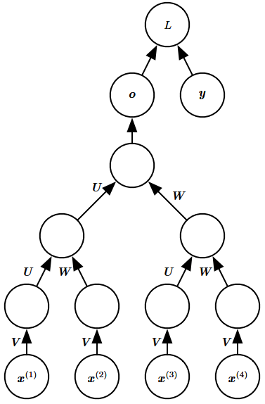

# Recursive Neural Networks
Recursive neural networks is represented with a comutational graph structured as a deep tree, rather than the chain-like structure of recurrent neural networks. Recursive networks have been successfully applied to processing data structures as input to neural nets in natural language processing and computer vision.

One clear advantage of recursive nets over recurrent nets is that for a sequence of the same length $\tau$, the depth can be drastically reduced from $\tau$ to $O(\log\tau)$, which might help deal with long-term dependencies.

An open question is how to best structure the tree. One option is to have a tree structure that does not depend on the data, such as a balanced binary tree. In some application domains, external methods can suggest the appropriate tree structure. For example, when processing natural language sentences, the tree structure for the recursive network can be fixed to the structure of the parse tree of the sentence provided by a natural language parser.[^deeplearning]

[^deeplearning]: Goodfellow, Ian, Yoshua Bengio, and Aaron Courville. _Deep Learning_. MIT Press, 2016.