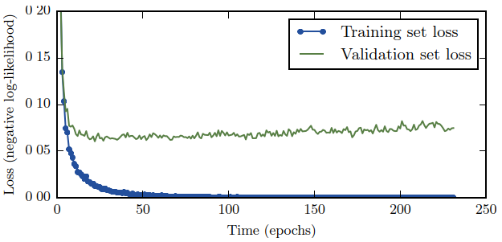

# Early Stopping
[Wikipedia](https://en.wikipedia.org/wiki/Early_stopping)

When training large models with sufficient representational capacity to overfit the task, we often observe that training error decreases steadily over time, but validation set error begins to rise again.

This means we can obtain a model with better validation set error (and thus, hopefully better test set error) by returning to the parameter setting at the point in time with the lowest validation set error. The algorithm terminates when no parameters have improved over the best recorded validation error for some pre-specified number of iterations.

Early stopping requires a validation set, which means some training data is not fed to the model. To best exploit this extra data, one can perform extra training after the initial training with early stopping has completed. In the second, extra training step, all the training data is included. There are two basic strategies one can use for this second training procedure:
- One strategy is to initialize the model again and retrain on all the data. In this second training pass, we train for the same number of steps as the early stopping procedure determined was optimal in the first pass. There are some subtleties associated with this procedure. For example, there is not a good way of knowing whether to retrain for the same number of parameter updates or the same number of passes through the dataset. On the second round of training, each pass through the dataset will require more parameter updates because the training set is bigger.
- Another strategy for using all the data is to keep the parameters obtained from the first round of training and then continue training, but now using all the data. At this stage, we now no longer have a guide for when to stop in terms of a number of steps. Instead, we can monitor the average loss function on the validation set and continue training until it falls below the value of the training set objective at which the early stopping procedure halted. This strategy avoids the high cost of retraining the model from scratch but is not as well behaved. For example, the objective on the validation set may not ever reach the target value, so this strategy is not even guaranteed to terminate.

Early stopping is an unobtrusive form of regularization, in that it requires almost no change in the underlying training procedure, the objective function, or the set of allowable parameter values. This means that it is easy to use early stopping without damaging the learning dynamics. This is in contrast to weight decay, where one must be careful not to use too much weight decay and trap the network in a bad local minimum corresponding to a solution with pathologically small weights.[^deeplearning]

[^deeplearning]: Goodfellow, Ian, Yoshua Bengio, and Aaron Courville. _Deep Learning_. MIT Press, 2016.