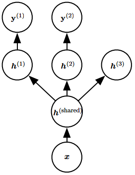

# Multitask Learning
[Wikipedia](https://en.wikipedia.org/wiki/Multi-task_learning)

**Multitask learning** is a way to improve generalization by pooling the examples (which can be seen as soft constraints imposed on the parameters) arising out of several tasks. In the same way that additional training examples put more pressure on the parameters of the model toward values that generalize well, when part of a model is shared across tasks, that part of the model is more constrained toward good values (assuming the sharing is justified), often yielding better generalization.

Improved generalization and generalization error bounds can be achieved because of the shared parameters, for which statistical strength can be greatly improved (in proportion with the increased number of examples for the shared parameters, compared to the scenario of single-task models). Of course this will happen only if some assumptions about the statistical relationship between the different tasks are valid, meaning that there is something shared across some of the tasks.[^deeplearning]

[^deeplearning]: Goodfellow, Ian, Yoshua Bengio, and Aaron Courville. _Deep Learning_. MIT Press, 2016.